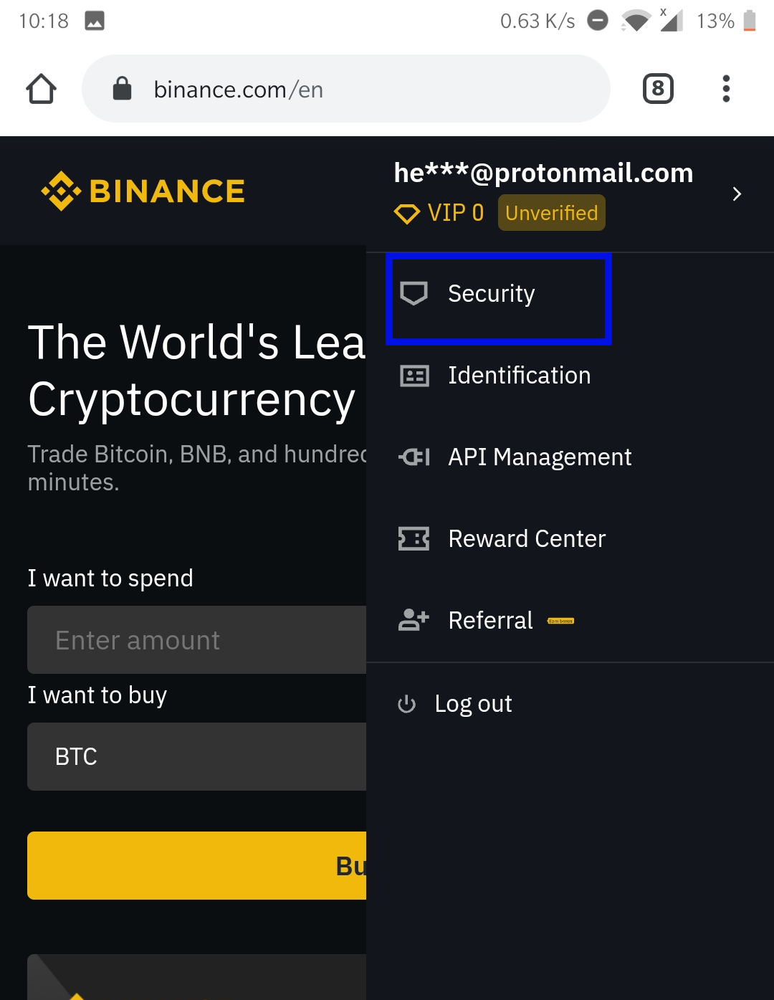

## Introduction

This guide demonstrates how to setup two factor authentication. This is a security feature that adds extra security to your account. Most if not all bitcoin exchanges have a wallet for each user and since the wallets contain valuable funds, bad actors are incentivized to use advanced tactics to hack into the wallets. Adding two factor authentication (2FA) adds an extra layer of security that protects your account against hackers. Some exchanges will not allow you to withdraw your funds without a 2FA, hence it is helpful to know how to set it up.

This guide can be used independently but it is part of the [How to open a USD wallet backed by bitcoin](/virtualusd-wallet) series. It also assumes that:

-    You have a binance account
-    You have bitcoin in your binance wallet
-    You have a localbitcoins account

However, anyone trying to setup 2FA for any account can follow it since the concepts are exactly the same. Only the exchange interface will be different.

If not, start with this guides: 
- How to open a binance account [link](/signup-binance)
- How to signup a localbitcoins account [link](/signup-lbc)

### Step 1 - Login to binance 

> The screenshots in this guide were made using the binance app. The interface is slightly different if you are using a web browser on phone desktop/laptop but the concepts and outcomes are exactly the same

- Open your binance application, and click **Account** at the bottom right button, then click **Login or Register**

- Enter the email and password you used to create your account as shown below:

### Step 2 - Go to bitcoin wallet

- Once you are successfully logged in, click the 'Funds' button at the bottom of the screen to see your all your balances;(different coins are shown with their corresponding balances). See screenshot below,:

- From the red highlighted sections, my bitcoin balance is **0.01764724**, which is equivalent to **$111.02**

- Click on **Withdraw** (highlighted in blue) to send the bitcoin. 
- You should get the following dialog box, instructing you to enable **2 Factor Authentication**

### Step 3 - Enable 2 Factor Authentication

> 2 Factor Authentication also referred to as 2FA is a required security feature of most cryptocurrency exchanges. Its aim is to protect your funds from being hacked.

> For the rest of the article I will use **2FA** for brevity

- Leave the mobile app and go to [binance.com](/https://www.binance.com/en) on a browser
- Login to your account using your email and password as shown in below screenshot

- At the top right, you should see the first two letters of your email circled. Click it and click the first option which is **Security** , as per the screenshot below:

- Clicking **Security** will redirect you to the below page:

- Currently, the account security level is **0** out of **4** (maximum)
- A minimum security level of 1 is required to withdraw funds
- In the screenshot above, the level 1(highlighted in blue) is achieved by enabling 2FA
- There is 2 options of enabling 2FA
   + A YubiKey (it looks like  USB drive), you can read more about it [here](/https://en.wikipedia.org/wiki/YubiKey) or [here](/https://www.wired.com/story/how-to-use-a-yubikey/)
   + Google Authentication
- Click **On** as shown in screenshot above. Google Authentication is enough for starters

- You will get the below screen showing there are 4 steps to activate 2FA for your account, and the first step is to download the **Google Authenticator** application from either Playstore(android users) or App Store(iPhone users) then click **Next**, I click 'Play Store' since I'm on android.

- If you are doing this from laptop/desktop browser, then search the **Google Authenticator** app in your phone's App Store or Play Store. 

### Step 4 - Setup the Google Authenticator app
> After enabling 2FA on your account, each time you login, or make a withdrawal, you will be required to enter your password, and a 6-digit fresh code that you get from this app. Codes can't be reused

- Open the **Google Authenticator** app. 
- Click on **Begin** as shown below

- Click on **Enter the provided code**

- Go back to the binance(web browser and not mobile app) security settings on binance and copy the code provided. You need to paste or type the code in the **Google Authenticator** as shown below: 

- Go back to the binance (web browser and not mobile app) security settings and click **Next** to go to Step 3, where you are advised to write the code on a piece of paper and store it somewhere safe. You will need this code to setup Google Authenticator 2FA on a new phone in case you change phones for whatever reason.

- Click **Next** to go to the last step. 
- Open the **Google Authenticator** app and copy the 6 digit code you see. See screenshot below 
>Note that the 6-digit code changes after a few seconds. You need to enter it and click submit before it expires
- Enter your binance password and the 6 digit code that you got from the previous step. See screenshot below
- Click **Submit**. If everything is correct, then you will get a green **Success** alert message at the top right

- If last step was successful, your security page should show your display the following:
+ Account security level is now (1/4) 
+ Enable 2FA has a green tick
+ A **Disable** button in the Google Authentication section at the bottom of your screen

