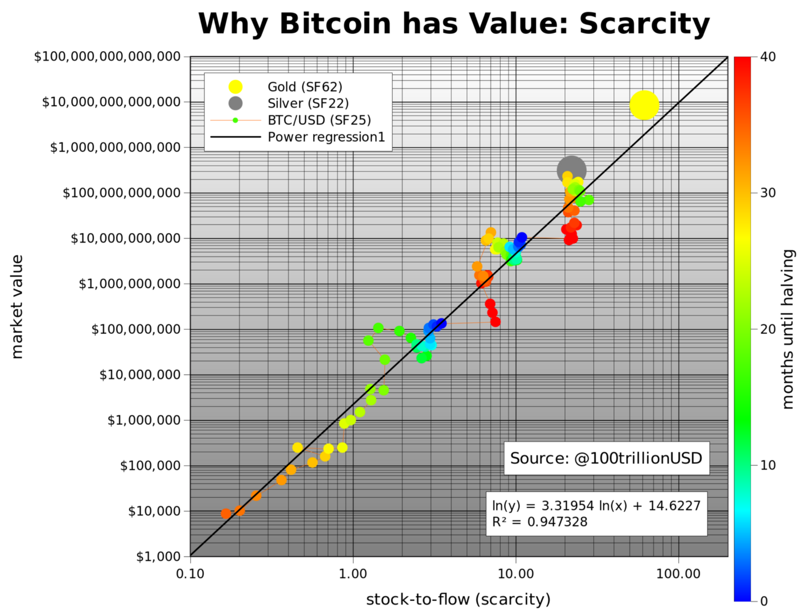

### What is bitcoin

Bitcoin is a digital asset/property that does the following:
- Savings tool: it has fixed total supply (21 million) 
- The absolute scarcity makes it attractive asset for long term investors to hold
- Payment: Bitcoin clears and settles globally within 30-60 minutes. It does micro-payments and even large transactions. Traditional systems 

This [link](https://www.lopp.net/bitcoin-information.html) shows information about bitcoin grouped in different categories and you can choose anywhere to start.

### The investment case for bitcoin

If you have these questions:
 -  Should I invest in bitcoin?
 -  Why does bitcoin has value? 
 -  Why has bitcoin's price increased from $0 to $7000 as of today (April 6th)
 -  Why will it keep increasing in value for the next forseable future?
 -  What is money? And what stages does money go through before it finally gets adopted by everyone?
 -  The properties that make bitcoin the best money ever in history

 These two articles cover those questions:

[Bitcoin Investment Theses (Part 1)](https://medium.com/@pierre_rochard/bitcoin-investment-theses-part-1-e97670b5389b) by Pierre Rochard

[The Bullish Case for bitcoin](https://medium.com/@vijayboyapati/the-bullish-case-for-bitcoin-6ecc8bdecc1) by Vijay Boyapati

### Bitcoin's value modelled against scarcity

This is a model that predicts the price of bitcoin using scarcity (stock-to-flow). Scarcity of an asset is measured by measuring the ratio of new supply to the existing supply.

When bitcoin started in 2009, 7200 bitcoins were being mined everyday, from 2012 this number halved to 3600, then in 2016 it halved to 1800 a day. In May 2020 it will reduce again to 900. As the daily supply decreases, the price increases, assuming constant demand.

The new supply will continue halving after every 4 years until 2140, when the last bitcoin will be mined, and miners will get paid by the transaction fees. Satoshi modelled the inflation rate to ensure that by the time the block-reward goes to zero, bitcoin will be used in so many transactions, and price of bitcoin will be too high such that the transactions costs alone will be enough to incentivize miners to continue verifying transactions and securing the network.

> For perspective, in the year 2136, 0.00000168 BTC will be mined per day

In this article , PLan B (an anonymous quant), models bitcoin's scarcity, compares it to other precious metals like gold and silver and shows that the price of an asset is tightly tied to its scarcity(stock-to-flow).

From this, we can infer the following:
- Gold is the yellow big circle. It's current stock-to-flow ratio is 62, while its total market capitalization is around $9T
- Silver is the grey circle. It's current stock-to-flow ratio is 22, while its total market capitalization is around $150B
- Bitcoin is the green circles. It's current stock-to-flow ratio is 25, while its total market capitalization is around $150B
- From May 12th 2020 to 2024, bitcoin's stock to flow will be 50, putting it near gold whcih is at 62
- The model predict's that bitcoin's market capitalization will then be more than $1T, hence putting the value of 1 bitcoin to be over $55,000

[Modeling Bitcoin's Value with Scarcity](https://medium.com/@100trillionUSD/modeling-bitcoins-value-with-scarcity-91fa0fc03e25)

With te below new model, written on April 27th 2020, Plan B updates the prediction to one bitcoin for $288,000.

He stops using time-series and adds other assets 9silver and gold) to the model which allows valuation of different assets like silver, gold, BTC with one formula.

[Bitcoin Stock-to-Flow Cross Asset Model](https://medium.com/@100trillionUSD/bitcoin-stock-to-flow-cross-asset-model-50d260feed12)

### The complete Satoshi

To read Satoshi's first announcement of bitcoin in a cryptography mailing list,the bitcoin whitepaper, see the first critics and how Satoshi responded to their questions firsthand in the early days of bitcoin. [The Complete Satoshi](https://satoshi.nakamotoinstitute.org/)

A compilation of pre-bitcoin literature that supports the idea of bitcoin from a cryptography and freedom point of view [click here](https://nakamotoinstitute.org/literature/)

A compilation of post-bitcoin articles that were written from 2012. They are highly vetted and new articles go through rigorous peer-reveiw before they are allowed here. [click here](https://nakamotoinstitute.org/mempool) Note the pun :) Mempool is what we call the bunch of transactions that are waiting to be mined.

>It took me months to go through all of this section, and by the time I finished I realized that the idea of bitcoin was worth exploring.

### History of bitcoin

Bitcoin did not just come from nowhere. See the motivations behind it and the efforts that were done from the 1970s till its inception.

For example the cypherpunks and cryptoanarchy communities where bitcoin cam from. [histoy of bitcoin](https://www.lopp.net/bitcoin-information/history.html)

### The technical side of bitcoin

Bitcoin code is + 30000 lines of C++ code, the code is open source on github and you can access it, view it, fork it and even make a pull request for your contribution to be evaluated and merged into the bitcoin protocol if it is deemed very important.

If you are technically curious about how bitcoin works under the hood, want to make APIs, or applications that interact with the bitcoin protocol, this article by Pierre Rochard is a good place to start [click here](https://medium.com/@pierre_rochard/understanding-the-technical-side-of-bitcoin-2c212dd65c09)

