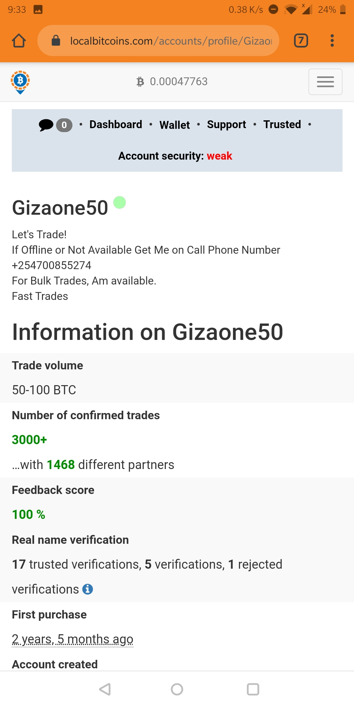

## Introduction

This guide shows you how to buy bitcoins. It is a continuation of the [How to buy bitcoin part I](/signup-lbc) which walks you through how to open an account at localbitcoins. This guide now shows you how to buy the bitcoins.

This guide assumes that:
  - You have a localbitcoins account. If not, [click here](/signup-lbc)
  - You have access to the email account you used to signup for the localbitcoins account
  - You have money in your M-Pesa/ MTN/ Vodacom/Airtel or bank whichever mobile money service you use.

### Step 1 - Login in to localbitcoins

Login to the [localbitcoins](https://localbitcoins.com/?ch=11uzd) account.

### Step 2 - Select a trader 

+ First select your country, the currency you want to use to purchase bitcoin and the amount you want to purchase so that you get matched with traders that fit your criteria. Normally, your browser will detect your location and show you traders from your country.
In my case I choose Kenya and KES as my currency.

+ View the offers by traders and select the one you want to buy from. Criteria to select trader:
    + Selling rate: this is the rate a trader is willing to sell bitcoin for. Lowest  rates are listed first so the lower the better. My selected trader's rate is **735,000.00 per bitcoin**
    + Trader ratings: Traders with 100% ratings are trustworthy and have not had a trading issue in the past. The higher the better. My selected trader's rating is **100%**
    + The number of trades has conducted: The higher the better. My selected trader has done over **3000 trades**
    + The minimum and maximum amount a trader is willing to trade. This depends on the amount you want to buy. Ensure you enter the amount you want to spend so that you only see traders that are within your limit. 

+ For my case I selected trader _'Gizaone50'_

To view more details about the traders reviews and ratings, click on the traders name and you will gsee something similar:

The key here is to avoid traders with bad ratings, very few trades and a low feedback score

### Step 3 - Initiate the trade

+ Enter the amount of bitcoins you want or the amount of local currency you want to spend.

+ In the chat box, ask the trader their payment details, click submit and wait for the trader's response. See screenshot below:

You should see the following notification/alert if you have initiated the trade successfully

### Step 4 - Send payment

The trader responds with their payment details as shown below, for my case I sent ksh.13,000 to their m-pesa number that the trader/seller gave me in his reply on the chat box

Immediately you send the payment, come back to the chat box, scroll down and Click the **I have paid** blue button as shown below:

> This step is very important, and you should do it immediately you initiate the trade. Never forget to do it!!

After clicking **I have paid** as shown above, you should see the below notification, which means that the bitcoins you are buying have been put into [escrow]. Once the seller receives the payment, they will inform escrow that they have received bitcoins and the bitcoins will move from the escrow wallet to your wallet. 

>Also ensure that all communications happen in the chat box, [escrow] has access to this messages and will arbitrate incase of any misunderstanding.

### Step 5 - Confirm bitcoins in your wallet

Most high-rated sellers will release bitcoins immediately they receive your payment. Refresh your browser after a minute and check the balance of your wallet, and the status of the trade in the chat box as shown below:

If you see the above screenshot, and that you have bitcoins when you click the wallet tab, the trade has been successfully completed!! You now have bitcoins!!

### Step 6 - (optional- Rate your trader)

All users on this platform, rely on each others ratings, both buyers and sellers. When you give a genuine feedback, it helps others in knowing who to trade with and who to avoid and who they can trade with. 

Scroll down the chat box and rate the trader based on your experience. I mainly use 'Trustowrthy' or 'Positive'. In 4 years of my experience I have only given one bad rating to a trader who wanted to scam me.

### Step 7 - What next ??

Now that you have finished buying bitcoins, there is several options based on your goals:

+ Store your bitcoins for long-term investment [Send to personal wallet](/store-bitcoin)
+ Save your money in USD value [Convert to USD](/virtualusdwallet)
+ Save your money in Gold value [Convert to gold](/buy-gold-xaut)

