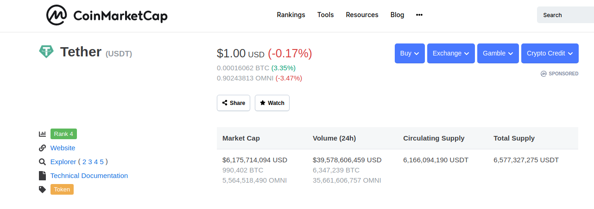
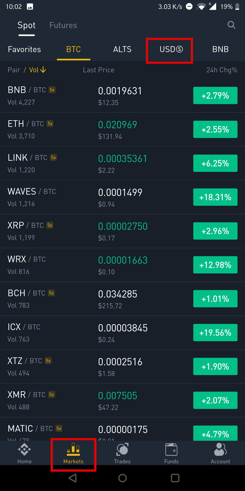
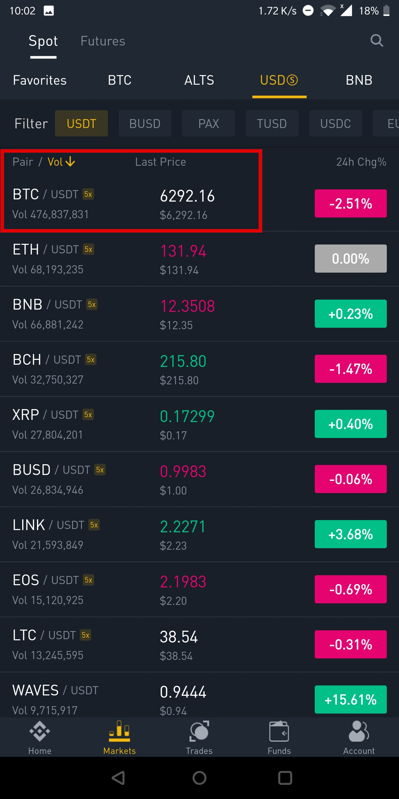
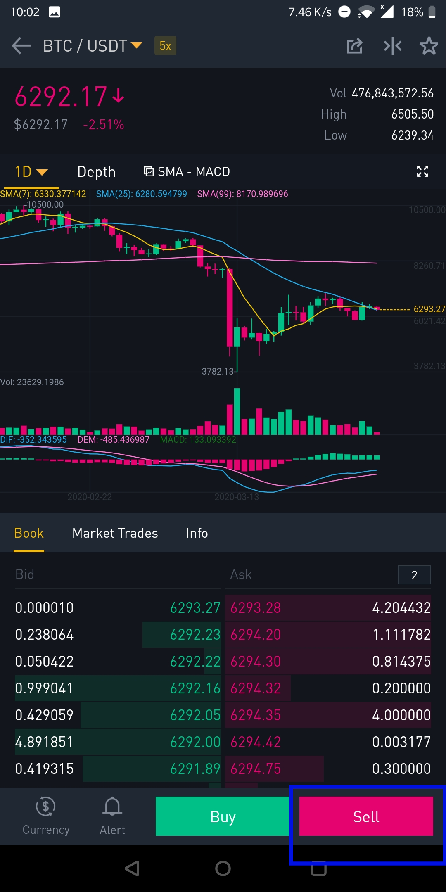
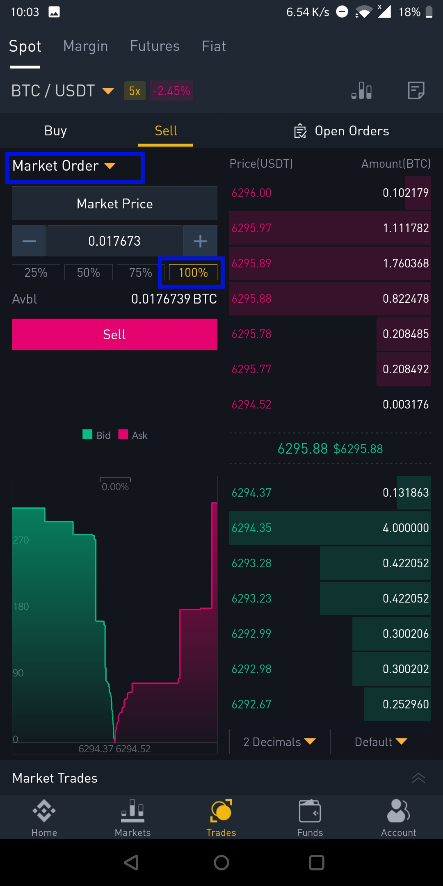
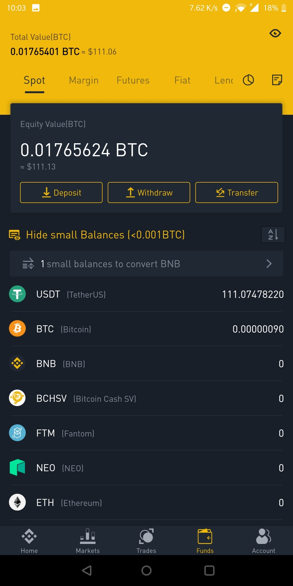
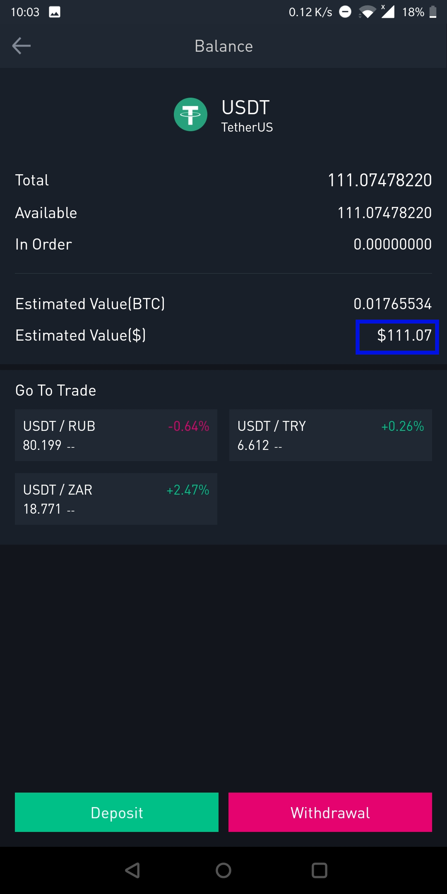

## Introduction

This guide is part of the [How to open a USD wallet backed by bitcoin](/virtualusd-wallet) series. It assumes that:

-    You have a binance account and wallet
-    You have bitcoin in your binance wallet

If not, start with this guides: 
- How to open a binance account [link](/signup-binance)
- How to buy bitcoin part II [link](/buy-bitcoin-lbc)

## What is Tether?

What is tether? It is a stable currency that mirrors the value of the US dollar. Every tether is 1-to-1 pegged to the dollar, meaning that you can always sell 1 tether for 1 USD.

Tethers are created when USD cash is deposited to a bank account, and destroyed when tether is redemmed for USD cash. Tether was created to faclitate movement of USD from one cryptocurrency exchange to another instead of relying on the slow traditional banking industry to move USD from one bank to another. On average, a SWIFT(international banking) transaction or famously called wire transfer takes 3-7 days depending on the banks.

Tether allowed traders to swiftly move USD across exchanges fast enough so they can do their trades, so that only the net **final settlement** of tether-cash would be done by large exchanges (Bitfinex) using specific banks. 

> Most banks do not support crytocurrency businesses. SOme banks have flagged wire transfers to most known exchanges. So tether is a workaround to circumvent that restriction

At the moment(April 2020) The market capitalization of tether is 6.176B and there are 6.166 billion tether in circulation. Data from [coinmarketcap](/https://coinmarketcap.com/)

### Why you need tether

There is two main reasons of why you may need tether:

- If you want to hold your wealth in USD Instead of your local currency
- If you think the current price of bitcoin will drop and you want to protect your profits and may be buy bitcoin at a lower price

There may be other reasons which other people know but this is what I know so far, so i will keep updating this list when I discover a new usecase

The next section goes into how to buy tether:

### Step 1 - Login to binance

> The screenshots in this guide were made using the binance app. The interface is slightly different if you are using the web browser on phone desktop/laptop but the concepts and outcomes are exactly the same

- Open your binance account, and click **Account** at the bottom right button, then click **Login or Register**

- Enter the email and password you used to create your account. 

Login to [binance](https://www.binance.com/en/register?ref=MMCI8T8U)

### Step 2 - Go to markets

If login is successful, click **Markets** at the bottom of the screen, then click **USDs** at the top right. Binance has many markets, you choose USD beacuse that is what you require. Observe screenshot below, currently we can only see the BTC markets; BNB/BTC, ETH/BTC, LINK/BTC. 

> How to read a price quote: for example ETH/BTC price is written as 0.020969, this means that 0.020969 bitcoins are required to buy 1 ETH or 1 Ethereum. 

> ETH, LINK, WAVES, XRP are different currencies, but can be bought by BTC

After clicking **USDs** , you should see the following screenshot:

This shows a list of different cryptocurrencies that can be traded(bought/sold) by Tether (USDT).

> BTC/USDT price reads 6292.16 , meaning you need 6292.16 tethers or USDT for 1 bitcoin

Click the BTC/USDT market as shown in above screenshot

### Step 3 - Selling bitcoin and buying tether
This page shows the order book, on the left/green side are limit buy orders and on the right/red side are the limit sell orders.
Click the red **Sell** button since we want to sell bitcoins and get tether (USDT).

After clicking **Sell** you will get the below page:

- Ensure the **Sell** button is highlighted in yellow as shown in the below screenshot
- Click the drop-down arrow, where you see **Limit Order** and make sure you select **Market Order**. Do not select **Limit Order** unless you have a price target you want to sell at in the future. Have explained the difference below:

> Limit orders is when you put a price that you want your trade to execute at. For example, you can put an order to sell your bitcoins at $9500. Since the current price of bitcoin is $6292, your limit sell order will remain in the order book till price reaches $9500 even if it will take 6 months or more for price to reach $9500

> Market order is when you put a buy or sell order to execute immediately. For this example, we placed a market order to sell our bitcoins, so our bitcoins will be sold at the current market rate ,which is $6291.29
- Select **100%** to indicate that you want to sell all your bitcoin for tether.
- Click the big red **Sell** button

- This trade executes immediately and your wallet now has USDT instead of bitcoins

### Step 4 - Confirm that your wallet has USDT

Click the **Funds** button at the bottom of the screen and confirm that you can see the USDT (Tether) balance you expected. If you bought tether using all your bitcoin then yoiu shoudl see a zero BTC balance. YOu shoudl also see the value of any other coins you hold.

### Step 5 - View your USD balance
Click the USDT (TetherUS) name to enter the Tether wallet. It should display as in below screenshot:

- The key thing here is the **Estimated Value($)** which in our case is **$111.07** 
- This balance will not change, no matter the price of bitcoin

You now have a USD wallet !!

#### DISCLAIMER
>The contents on this site are for informational and entertainment purposes only and does not constitute financial advice. By using this site, you agree to hold me harmless from any loss that may occur to you as a result of acting on information found on this site.