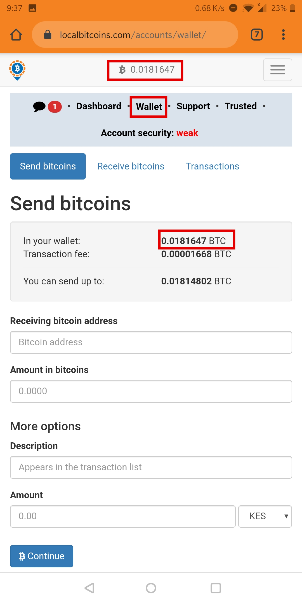
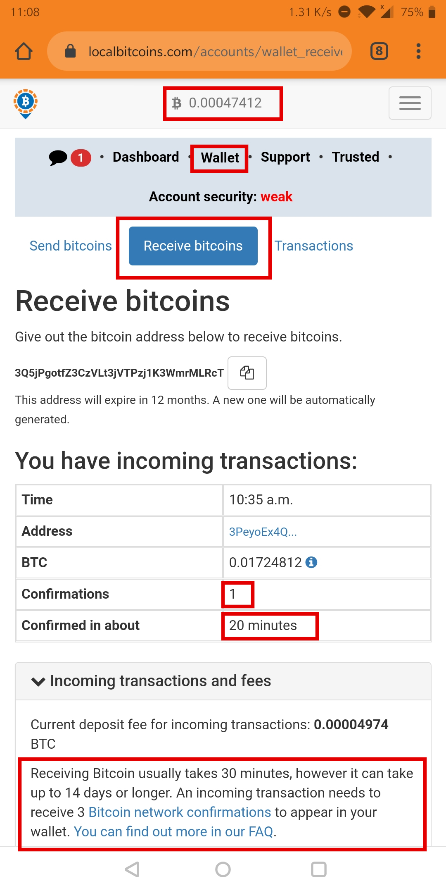
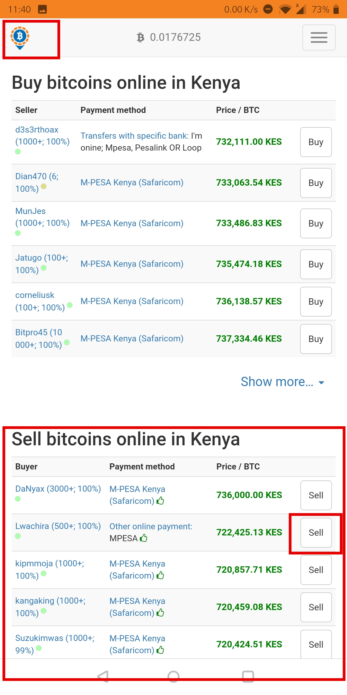
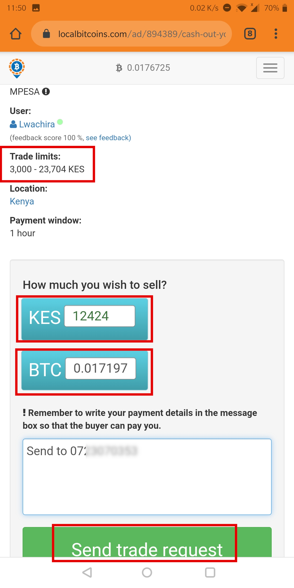
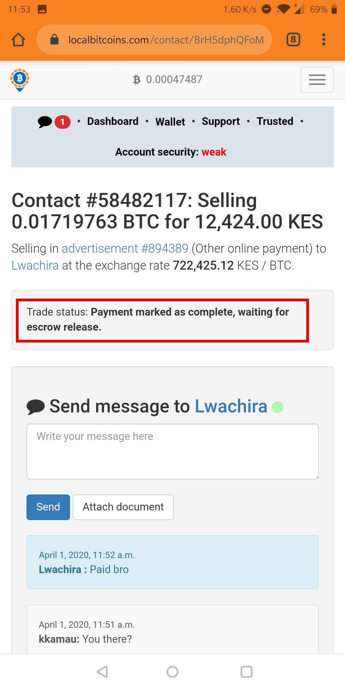
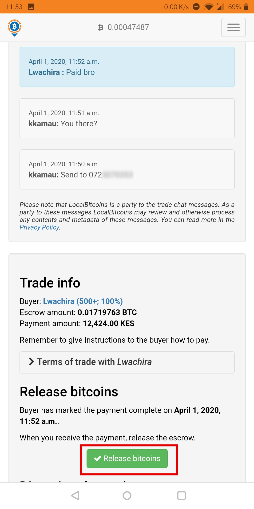

## Introduction

This guide is part of the [How to open a USD wallet backed by bitcoin](/virtualusd-wallet) series. It assumes that:

-    You have a localbitcoins account
-    You have bitcoins in your localbitcoins wallet

If not, start with this guides: 
- How to open a localbitcoins account [link](/signup-lbc)
- How to buy bitcoin [link](/buy-bitcoin-lbc)

### Step 1: Login 

First step is to login to your localbitcoins account

### Step 2: Check balance in your wallet

- Click the **wallet** button and you should see your bitcoins balance as shown below:

That is the amount of bitcoins that you can sell.

### Step 3: (optional) If you are waiting to receive the bitcoins from binance

- This applies if you have just sent bitcoins from binance to localbitcoins, and want to check the status of the transaction.

- Click **wallet**, then the **Receive Bitcoin** tab as shown below:

- Note that the confirmation is currently **1**, you cannot sell the bitcoins until the confirmations are **3**

- **Confirmed in about** is 20 minutes, that is the estimated amount of time that you need to wait till you can sell your bitcoins

### Step 4: Navigate to sell bitcoins and choose a trader

Localbitcoins is a peer-to-peer marketplace, so you need to select the trader that meets your terms. For my case i chose _lwachira_ since he can buy my 0.017197 bitcoins at the best rate.

### Step 5: Initiate the trade

To initiate a trade, click the trader (buyer of your bitcoins), then enter the amount of bitcoins you want to sell or the amount of KSH you want.
   - I am selling 0.017197 BTC
   - I will receive KES 12,424
   - I provide my M-Pesa number so the trader can send me

### Step 6: Wait to receive payment

Wait for a few minutes to receive mobile money payment or bank payment. When the buyer of bitcoins makes the payment, they will mark payment as complete and your bitcoins will move to escrow wallet, awaiting your confirmation to have received payment.

### Step 7: Release the bitcoins

If and **ONLY IF** you confrim you have received the money in your account, click the green **Release bitcoins** button.

## Conclusion

This marks the end of the series of converting KSH to Virtual USD wallet and back to KSH using bitcoin in the background. 