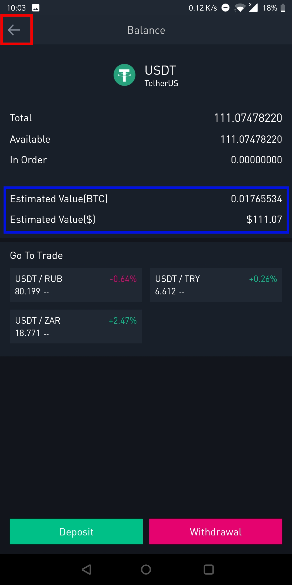

## Introduction

This guide is part of the [How to open a USD wallet backed by bitcoin](/virtualusd-wallet) series. It assumes that:

-    You have a binance account and wallet
-    You have tether (USDT) in your binance wallet

If not, start with this guides: 
- How to open a binance account [link](/signup-binance)
- How to buy tether(USDT) [link](/buy-tether)

### Step 1 - Login to binance

> The screenshots in this guide were made using the binance app. The interface is slightly different if you are using the web browser on phone desktop/laptop but the concepts and outcomes are exactly the same

- Open your binance application, and click **Account** at the bottom right button, then click **Login or Register**

- Enter the email and password you used to create your account. 

Login to [binance](https://www.binance.com/en/register?ref=MMCI8T8U)

### Step 2 - Confirm how much USD you have

Once you are successfully logged in, click the 'Funds' button at the bottom of the screen. See screenshot below:

My tether(USDT) balance is **111.07** and the estimated value is **$111.13**. Rate is **0.999** when you calculate **111.07/111.13**

To see more details of your USD balance, click on **Tether(USDT)** as circled in blue. See screenshot below which gives you more details of your USD wallet.

> The estimated value of USD ($) is constant. 

> The estimated value of BTC will change. If price of bitcoin goes higher, the value decreases, and if bitcoin price increases then the value increases.

Now click the back arrow at the top left to go back to the previous screen where you can enter the BTC/USDT market and trade. 

### Step 3 - Sell tether / buy bitcoin

- Ensure you clicked the top left arrow to go back to the markets. In step 2 above

- Click **Markets** , then **USDs**, then **USDT**, all buttons are highlighted in a blue rectangle

> BUSD, PAX, TUSD, USDC are different stablecoins, backed 1-to-1 to the US dollar. I strongly recommed Tether (USDT) due to its high liquidity and longer reputation in the market, being the pioneer of stablecoins

This step involves the actual selling of tether to get(buy) bitcoins which you can sell to your local currency. 

- Click on the BTC/USDT pair as shown below in the screenshot below:

> How to read a price quote: for example BTC/USDT price is written as 6292.16, this means that 6292.16 tethers or US dollars are required to buy 1 BTC(bitcoin). 

> ETH, BNB, BCH, XRP are different currencies, but can be bought by USDT (Tether)

- Click the big green **Buy** button at the bottom of the screen as shown below:

- Click the drop-down to select **Market Order** , then select the % of tether(USDT) you want to sell, for my case i selected 100%, then click the big green button written **Buy**

- This trade executes immediately, next step is to check your wallet and confirm that you no longer have Tether (USDT) but instead you have BTC

### Step 4 - Confirm wallet has bitcoins(BTC) instead of Tether (USDT)

- Click the **Funds** button highlighted with a red rectangle.

- Confirm that the Tether(USDT) balance is zero or near zero (highlighted in blue rectangle)and

- The bitcoin balance is equivalent to the tether that you sold in step 3 above.For rhis example, its **0.00337356** (highlighted in blue rectangle)

- Confirm the USD equivalent value for the bitcoin that you have. This is how much actual USD you would get if you sell the bitcoin (highlighted in blue rectangle)

                    This is the end of this guide. 

If you want to sell your bitcoin to your local currency/fiat, click this [link](/sell-btc) where I demonstrate how to sell  bitcoin to Kenya Shillings via M-Pesa

If you want to store your bitcoin to a more secure wallet (mobile app, laptop/desktop, hardware wallet) click this [link](/store-bitcoin) where I explore different techniques of storing bitcoin as a long term investment.
