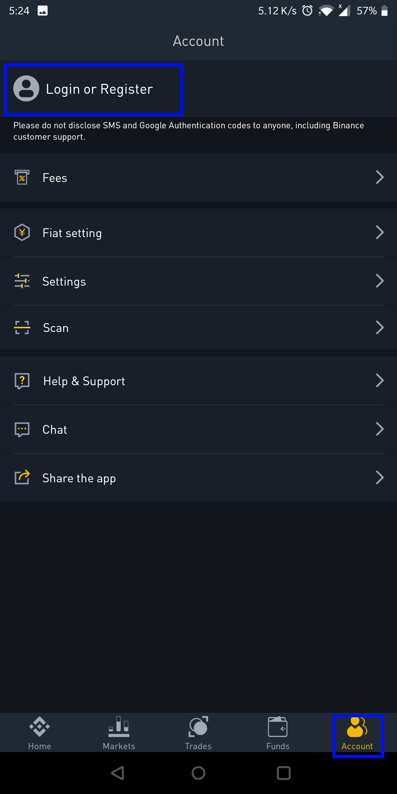
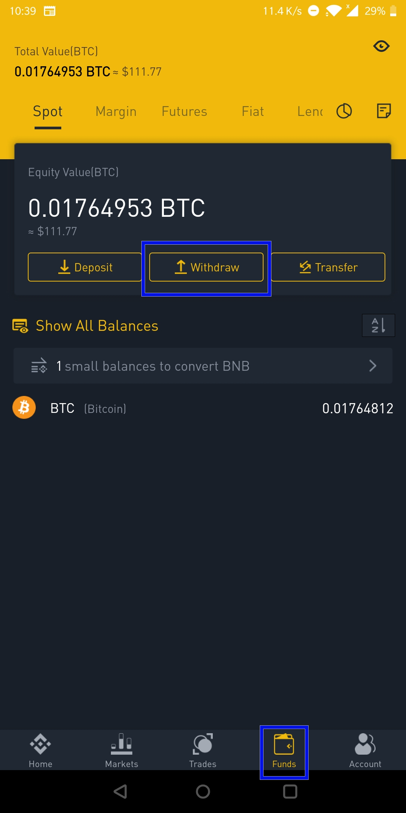
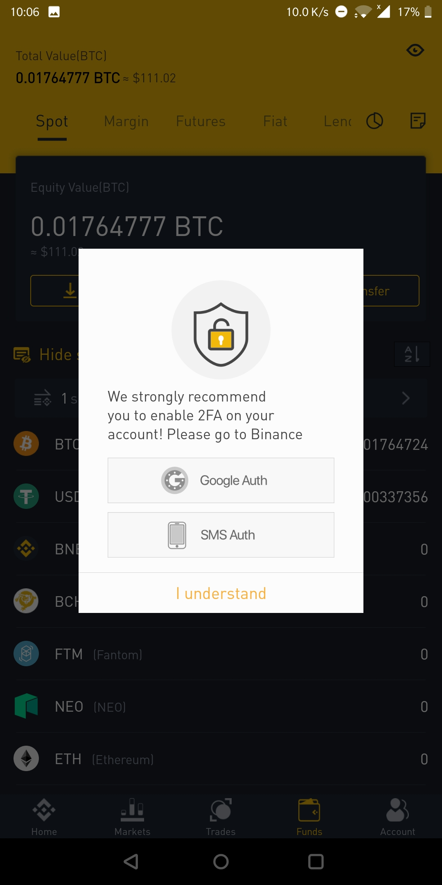
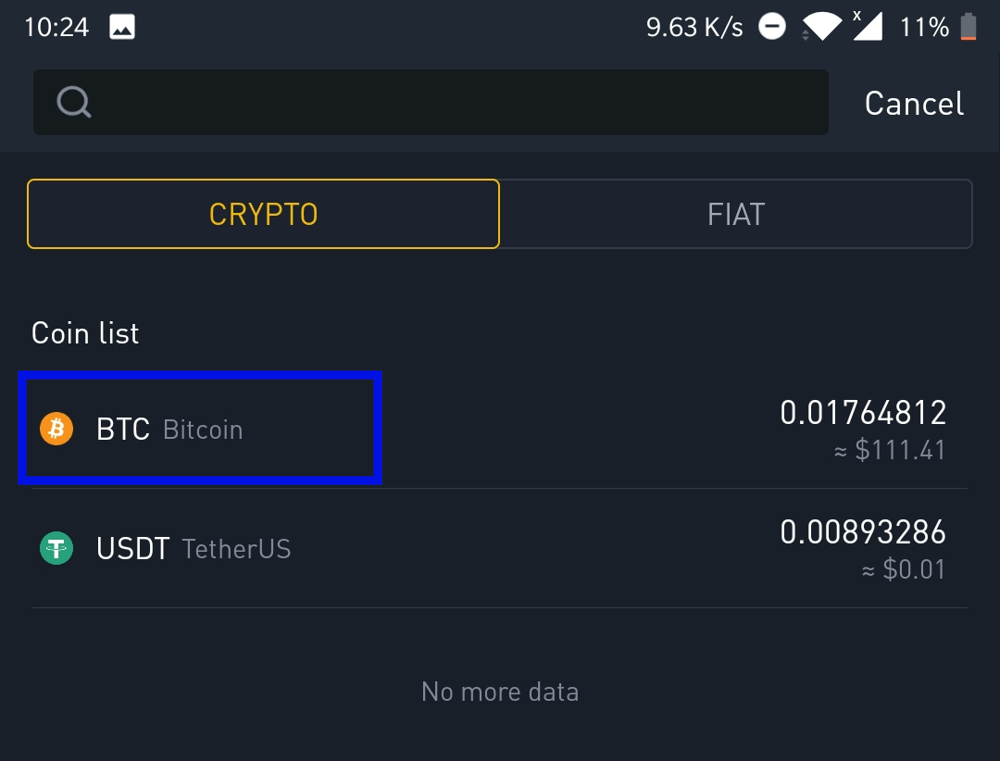
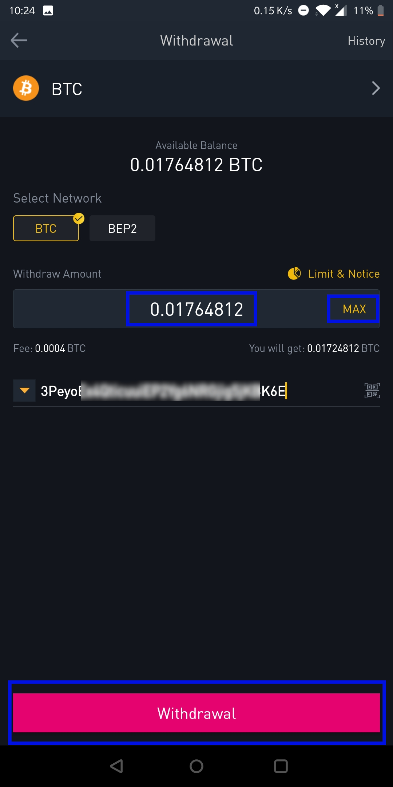
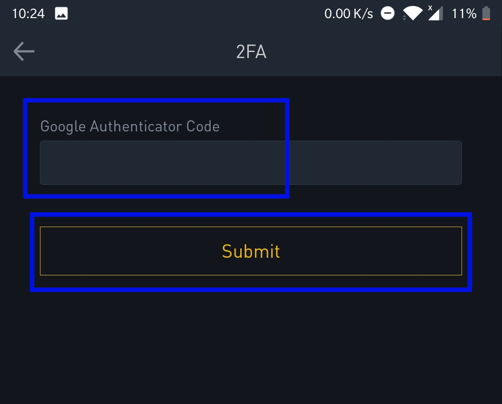
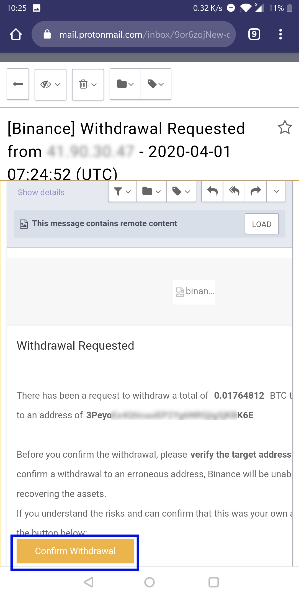
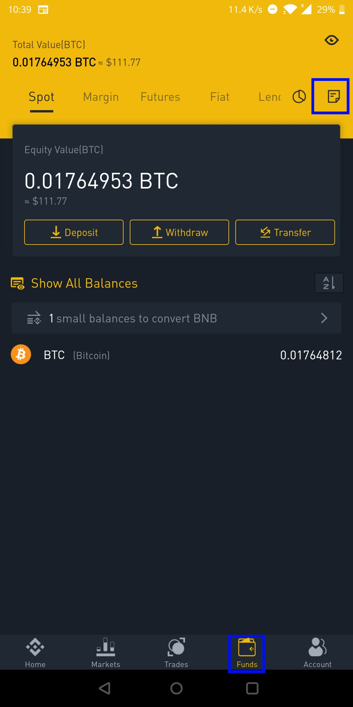
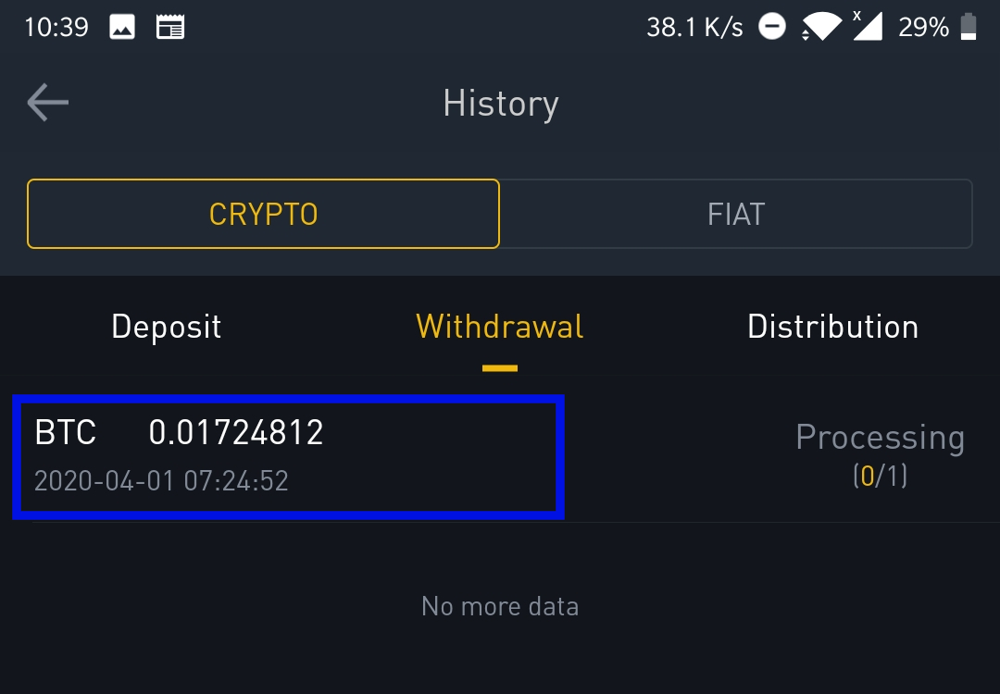
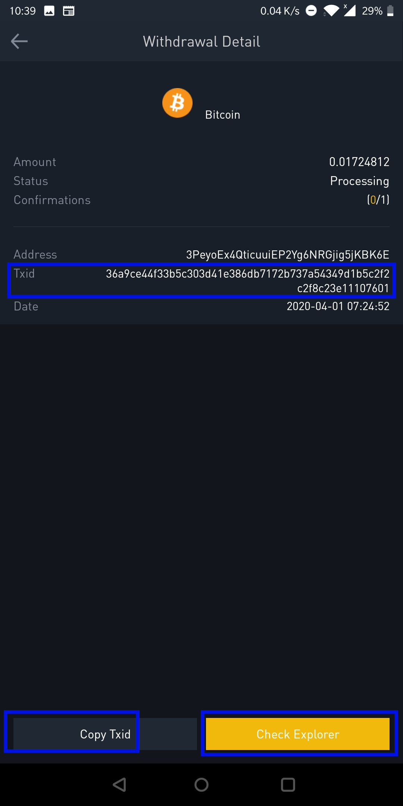

## Introduction

This guide is part of the [How to open a USD wallet backed by bitcoin](/virtualusd-wallet) series. It assumes that:

-    You have a binance account
-    You have bitcoin in your binance wallet
-    You have a localbitcoins account

If not, start with this guides: 
- How to open a binance account [link](/signup-binance)
- How to signup a localbitcoins account [link](/signup-lbc)

### Step 1 - Login to binance 

> The screenshots in this guide were made using the binance mobile app. The interface is slightly different if you are using a web browser on phone desktop/laptop but the concepts and outcomes are exactly the same

- Open your binance application, and click **Account** at the bottom right button, then click **Login or Register**

- Enter the email and password you used to create your account as shown below:

- You will get a prompt to enter your two-factor authentication.
- Open your 'Google Authenticator' app and copy the code you see
- Paste it into the 2-Factor authentication code prompt

### Step 2 - Go to bitcoin wallet

- Once you are successfully logged in, click the 'Funds' button at the bottom of the screen to see your all your balances;(different coins are shown with their corresponding balances). Then click 'Withdraw'. See screenshot below,:

- From the red highlighted sections, my bitcoin balance is **0.01764812**, which is equivalent to **$111.77**

- Click on **Withdraw** (highlighted in blue) to send the bitcoin. 
- You should get the following dialog box, prompting you to enable **2 Factor Authentication** 

if you had not done so, click [here](/binance-2fa) for a step-by-step guide on enabling 2 Factor authentication

- You should see the below screen if you had alrady enabled 2-Factor authentication:

### Step 3 - Enter amount of bitcoins to withdraw and their destination address

Enter the following as shown in the screenshot below:

- the amount of bitcoins (it has to be less than what is available in your wallet, and you can also select **MAX** to withdraw everything) 
- and the destination address. 
- then click the pink **Withdrawal** button at the bottom

### Step 4 - Confirm withdrawal (2FA and Email confirmation)

Binance adds additional steps to verify each withdrawal in order to add more protection to your funds. The first is :
 - To enter a 6-digit verification code, and if it is correct,
 - To verify the withdrawal by clicking a link sent to your email

- You will get a prompt to enter the **2 Factor** authentication. Open your **Google Authenticator** app and copy/memorize the 6-digit code you see, paste/type/enter the 6-digit code as shown below:

- If code is correct, you will be prompted to check your email and click the verification link. This is exactly the same thing you did while signing up. The email resembles the one shown below:

### Step 5- (Optional) Wait for 10-60 minutes then check the destination wallet

As you wait, you can confirm that the status of the withdrawal by navigating to **Funds** , then click the top right, where it looks like a paper/page being turned

This page shows you the status of transactions; both deposits and withdrawals. In this case, click the **Withdrawal** tab

If you click on the BTC transaction , as highlighted in blue , you should see the below transactions details. 

- You can click on **Check Explorer** or

- You can click **Copy Txid** to copy the Transaction ID (txid) and paste it in another blockchain explorer like blockstream.info or mempool.space to see better visual representation of the status of your transaction.

