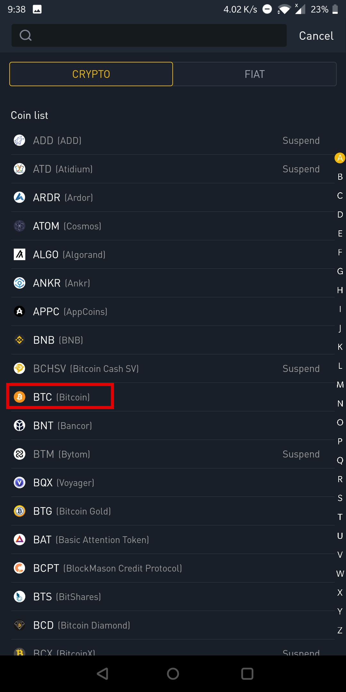
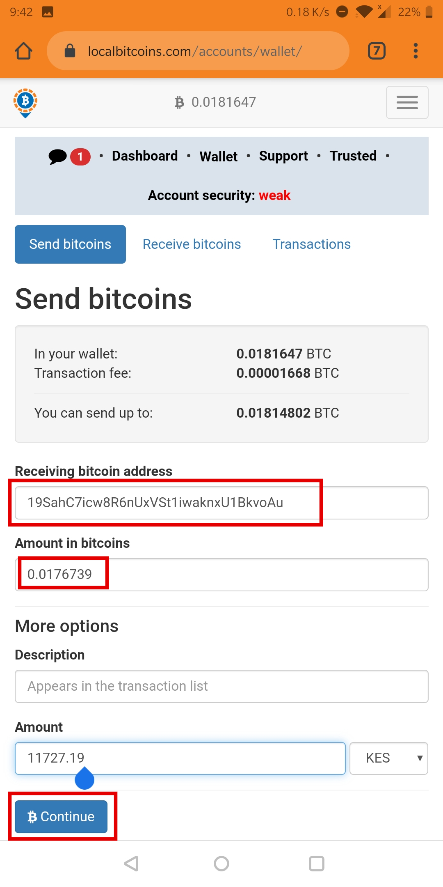

## Introduction

In this guide ,I demonstrate how to send bitcoins from localbitcoins to binance. There is different reasons to send bitcoins to binance but in this example, the motivation is to create a 'bitcoin-backed' USD wallet to enable you store your savings in USD rather than your local currency.

It assumes that:
+ You have a binance account. If not ,click [here](/signup-binance)
+ You have bitcoins in the account you want to send bitcoins from. If not, click [here](/buy-bitcoin-lbc)
+ You have a localbitcoins account. If not, click [here](signup-lbc)

### Step 1 - Login to localbitcoins account

Login to your [localbitcoins](https://localbitcoins.com/?ch=11uzd) account. How do I login? [Remind me](/signup-lbc/#Step-7)

### Step 2 - Go to wallet

After successful login, navigate to your wallet as shown below:

The screenshot above shows that:
+ my wallet has 0.0181647 BTC
+ transaction fee to send that bitcoin is 0.00001668 BTC
+ i can send up to 0.01814802 BTC (this is total balance - transaction fee)

> Transaction fee is what miners are paid to verify and send your transaction. Read more about this in [How does mining work](/bitcoinmining)

### Step 3 - Login to binance account

Since we want to send the bitcoins in localbitcoins to binance, we need to login to binance and get the bitcoin address that we will send the bitcoins to. This is like finding out the bank account of someone you need to send money to.

Login to [binance](https://www.binance.com/en/register?ref=MMCI8T8U) using your email and password if you using the web browser to access binance.

If you are unsure of how to login:
-  If using mobile app check [Step 6](/signup-binance/#Step-4) 
-  and if uisng browsers like chrome check [Step 4](/signup-binance/#Step-4) then come back to this guide.

### Step 4 - Go to wallet/funds

Once logged in, click the **Funds** tab as shown below:

Your wallet displays the balances for all coins you own. See screenshot below. If its your first time, the balance will be zero.

### Step 5 - Get your bitcoin address

>A bitcoin address is like an account number, it is the destination of where funds are sent. We need to get the bitcoin address here, then use it as the destination while sending bitcoins from localbitcoins.

Now, click **Deposit** as shown in the screenshot in step 4 above. You will get a long list of coins to choose from, note that your binance wallet can hold over 100 cryptocurrencies, so you need to choose btc **bitcoin**. See screenshot below:

If you chose BTC/Bitcoin then you should see the screenshot below. Click **Copy Address** and it will automatically copy the bitcoin address to your clipboard 

   >Clipboard is feature in phones and computers that allows you to copy something and paste it elsewhere. Always use copy-paste while dealing with bitcoin addresses since it is easy to make a typo. 

The bitcoin address I will use for this example is this alphanumeric character string **19SahC7icw8R6nUxVSt1iwaknxU1BkvoAu**
  >  bitcoin addresses can either start with 1,3 or bc1. And they have 34 characters of random alphanumeric characters apart from uppercase letter "O", uppercase letter "I", lowercase letter "l", and the number "0"  

### Step 6 - Send to the bitcoin address

+Now that we have copied our bitcoin address, go back to localbitcoins and paste the bitcoin address to the **Receiving bitcoin address* field, 
+ Then put the amount of bitcoins you want to send in the **Amount in bitcoins** field,
+ And click the big blue **Continue** button.

+ You will be required to enter your password to verify the transaction as shown below:

You have **completed** sending bitcoins. 

Wait for 20-30 minutes for your coins to reach binance. Then check your binance wallet, this is what to expect, see screenshot below:

>The rest of the section discusses how to verify, and how to track the status of the transaction.

### Step 7 - Confirm that bitcoins have been sent (optional)

At this point the send transaction has been sent, it is irreversible and we can only confirm that we have sent the bitcoins and check the status.

> Bitcoin transactions take between 5 - 60 minutes depending on how the network is busy (how many other people are making transactions).

To check the status of the transaction we have just made, navigate to the **Transactions** tab and view, you should see something like below: 

+ The **fee** is the transaction fee, just like M-Pesa tranaction cost or bank charges
+ The **txid** is the transaction ID of the transaction

> Every bitcoin transaction since 2009 has a unique ID. You can use it to track the status of the transaction in the blockchain

> You can choose between several online tools to track the status of a transaction. My personal favourites are blockstream.info and mempool.space

Below is what I saw when I tracked the status of this transaction using [mempool.space](/https://mempool.space/)

+ On the left image, click top right to get the search box
+ Paste the txid (copy the texid from localbitcoins transaction details)
+ Click the **Search** button

On the right image:
+ The **Unconfirmed** means the transaction has not been mined yet
+ The first seen 4 minutes, means its been waiting for 4 minutes
+ The ETA indicates how long till the transaction is mined

You can also paste the txid in blockstream.info and see what you will get.

