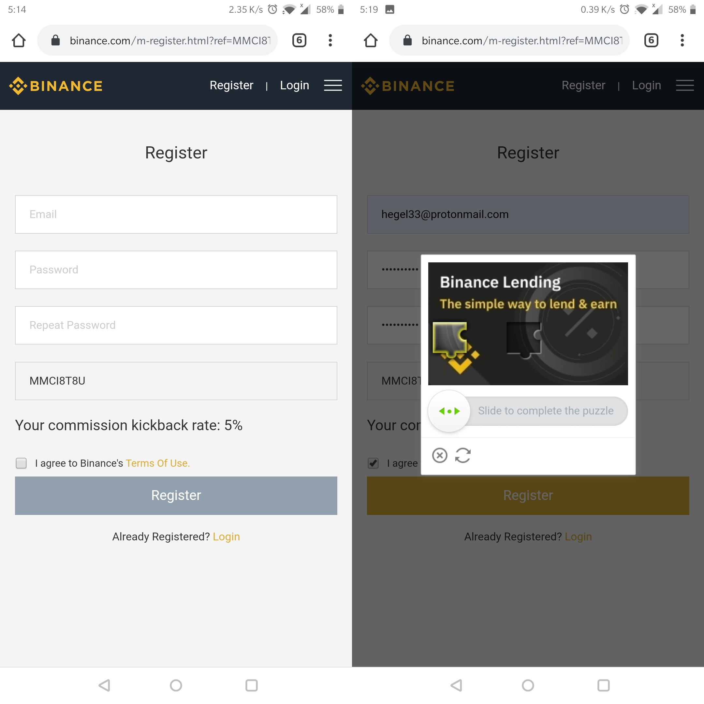

As of 2020 March when I'm writing this, [binance](https://www.binance.com/en/register?ref=19683719) is the biggest cryptocurrency exchange. Has only been hacked once, and the users affected were refunded immediately. It also has a very friendly user interface, which is one of the reasons that binance was able to rise in poularity since it was launched in 2017. It is for the above reasons that I recommend it for specific usecases.

This guide simply shows how to signup for an account.
Note that the screenshots are combined to make the post more readable. Each image represents two different screenshots.

### Step 1

Click the link below to be redirected to [binance](https://www.binance.com/en/register?ref=MMCI8T8U)

You should see below, the 5% kickback commission rate is the trading fees discount you get by using my affiliate link. 

Enter your email and password twice. The password should be at least 8 characters, contain UPPERCASE, Lowercase and digits.

### Step 2

After sliding to complete the puzzle you will get two notifications as shown below:
- That the 'slide' verification has succeeded &
- A request to access your email and click the verification link sent by binance

### Step 3

Open your email, check new email in your inbox from 'binance'. If you see no email just check in your spam folder.

Below screenshots show how the email looks like. After clicking the orange **Confirm Registration** button, your account will be verified and you will see the **Succeed** notification that confirms your account is verified and ready to log in

### Step 4

Click the **Login** button and enter the email and password you used in Step 1.

You will be required to 'slide the to complete the puzzle'. As shown below:

If you are using a laptop/desktop computer, that is the last step in signing up!! You can view the markets, and explore binance.

If on mobile, you can now use binance via the browser or you could proceed to step 5 where we download the binance mobile app. 

### Step 5 (optional)

I have written this post using mobile screenshots, since currently most users consume online content from their mobile devices. From experience and dealing with many users, I highly recommend downloading the binance android or iOS apps to have smooth experience.

After login, click the orange **Download** at bottom of the screen. See the 3 screenshots below that show you the installation process:

### Step 6

After the app is downloaded. Open it, and click the the bottom right section written '**Account**'. Then click '**Login or Register**' , enter the email and password you used in **Step 1** and slide the verification slider. Screenshots are shown below:

### Step 7 

If the email, password and verification slider was done correctly in **step 6** above, then you will be prompted to enter a **verification code** which has been sent to your email. 

Check your email for a new inbox from binance, and enter the code sent there. 

Screenshots below show how to enter the verification code and how your account settings should look if everything has been done correctly.

If you see your email as shown in the last screenshot. That is; with just a few characters, know that you have :
- Successfully opened a binance account
- Successfully installed the binance mobile app
- Successfully logged in

And you are ready to start trading!!

