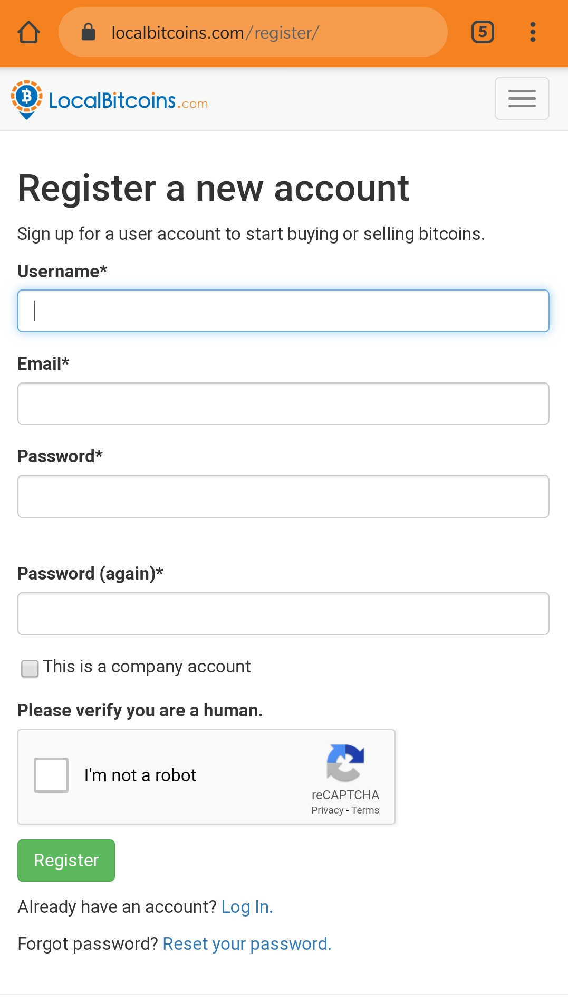
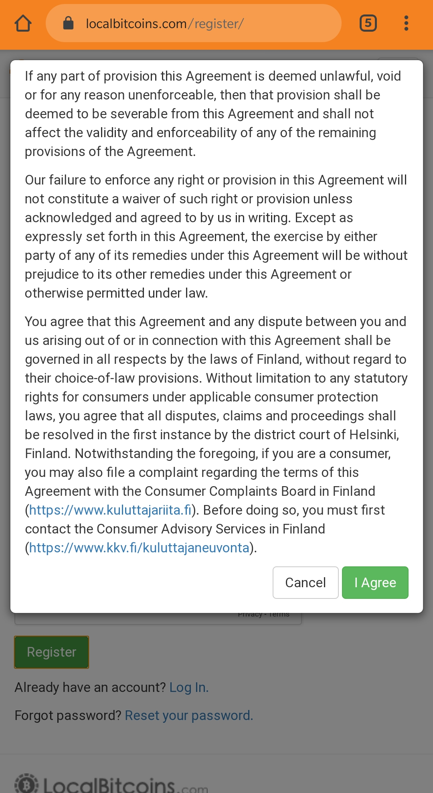
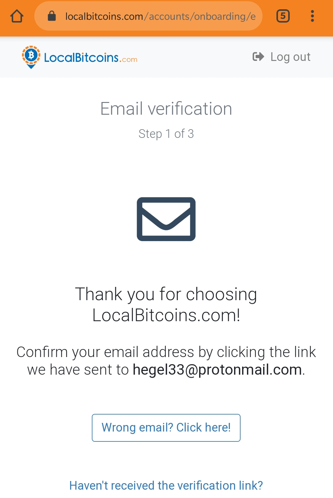
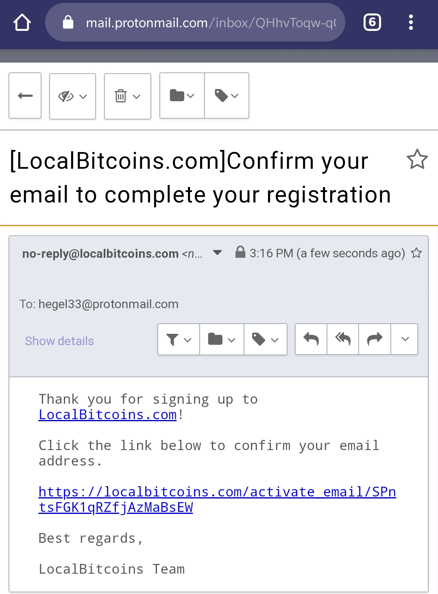
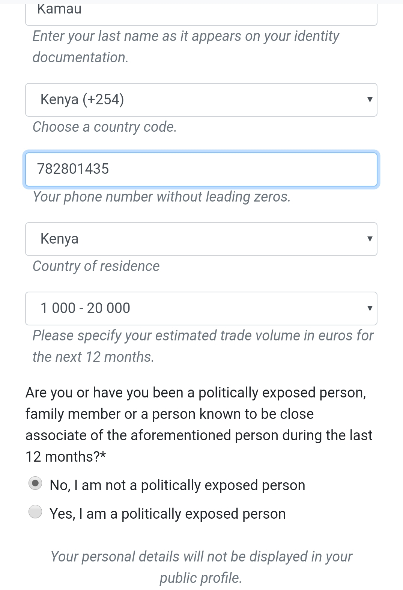
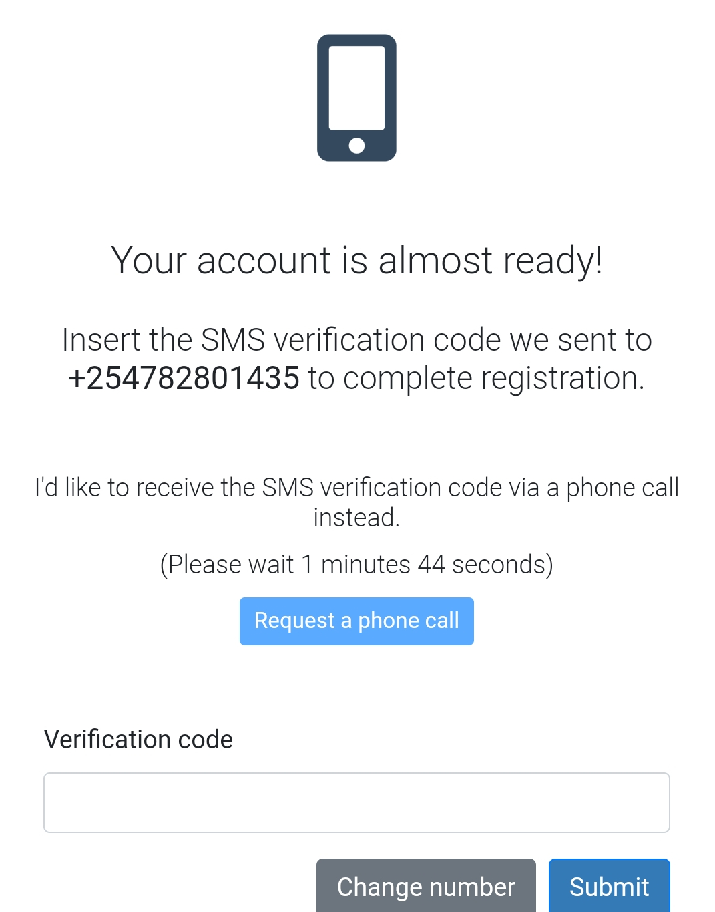
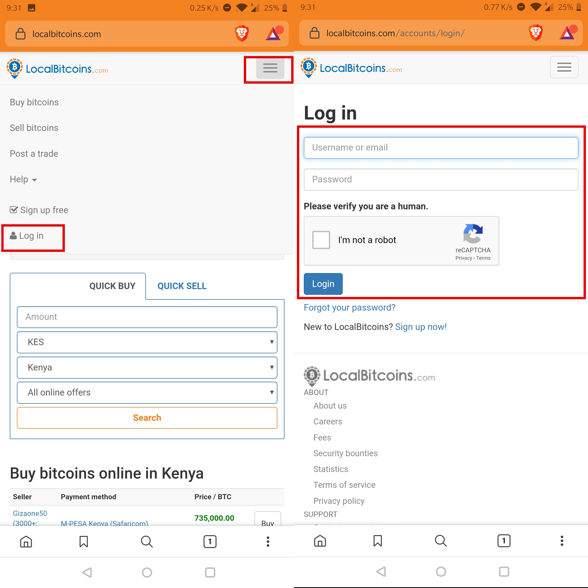

This is a step-by-step guide on how to open a localbitcoins account. It enables you to buy or sell bitcoins, and access to a bitcoin wallet that can send and receive bitcoins.

### Some background

- For readers in East Africa, this is like your _M-Pesa agent, MTN, wakala_ who trades cash to mobile money and vice versa, only that in this case it is where you trade bitcoin to mobile money and vice versa.
- Signing up requires an email, full name as in your identification card, and a phone number. To trade more than $1200 a year, more verification details are required.
- If you do not want to do a lot of KYC and want to trade larger volumes, head over to localcryptos.com. I only recommend this option to experienced bitcoin users who are already familiar with bitcoin wallets and how transactions that rely on escrow work.
- Localbitcoins is a peer-to-peer exchange, meaning that there is many independent buyers and sellers who set their trading terms,rates, payment methods etc). You are not buying bitcoins from a company. 
- Localbitcoins only exists to provide an [escrow](https://www.thebalance.com/what-is-escrow-315826) platform. 
> Escrow is a financial arrangement in which two parties enlist a “third party” (who is neither the buyer nor the seller) to temporarily hold money, paperwork, or other assets for a transaction on their behalf before the transaction has been finalized.

>That third party, known as an escrow provider, helps make the transaction safer by protecting the assets of the buyer and seller until both parties have met their obligations for the agreement. Ideally, the escrow provider is a neutral third party who isn't concerned with whether the buyer or seller comes out ahead.

### Step 1

Visit [localbitcoins.com](https://localbitcoins.com/?ch=11uzd) and click the '**Sign up free**' green button 

### Step 2

 - Enter your username in the **Username*** field
 - Enter your email in the **Email*** field
 - Enter your password in the **Password*** field (password should be 8 characters long)
 - Enter your password again in the **Password(again)*** field
 - CLick the 'I'm not a robot' checkbox, follow the instructions e.g. choose cars, buses, crosswalks whatever the captcha tells you
 - Click the green 'Register' button

You will be required to accept the **'Terms of Service'**, scroll down and click **'I agree'** , then 
You will be then required to accept the **'Privacy Policy'**, scroll down and click **I agree**

### Step 3

If your email, password in step 2 above are valid, you will be redirected to the page below:

Now open your email, check inbox and you should receive an email from localbitcoins, like shown below. Click the link in the email to confirm that it is you !

### Step 4

After clicking the link in [step 3](/signup-lbc/#Step-3) above, you will be redirected to the page below which requests you to enter your full names, phone number and an estimate in Euros of your transaction volume.

### Step 5
If the mobile number entered above is valid, reachable and not used on localbitcoins before, you will receive a text message with a code. Incase you don't receive an SMS, click the **'Request a phone call'** blue button and you should receive an automated voice call that reads for you the verification code, it is repeated thrice.
Input it in the verification code input field as shown below:

### Step 6
If step 5 above was successful, your account setup was successful 

### Step 7
 Test by logging in to your localbitcoins account using the email and password you used in [Step 2](/signup-lbc/#Step-2)

 Go to [localbitcoins](https://localbitcoins.com/?ch=11uzd), navigate to the top right to where you will see 3 horizontal bars, click there, click **Log in** and enter your email and password, click the **I'm not a robot** checkbox and click **Login**. See the screenshots below:

