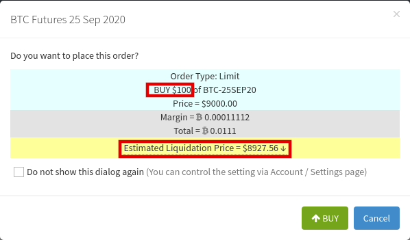

## Outline

- Difference between spot trading, margin traidng and futures
- Select an exchange
- Signup to deribit
- Activate Level 0 verification 
- Deposit bitcoin
- Make a futures trade using just $1
- Evaluate the opportunity vs the risk by varying the quantity of contracts and seeing how the liquidation price changes
- Set stop loss, and take profit
- Pro-Tips
- Resources

### Spot Trading

When you buy bitcoin at localbitcoins, paxful or localcryptos, you are buying bitcoin on the spot. You give fiat (KSH, USD or Euro) and get bitcoin in return, and that is described as a 'spot transaction' which is the most basic type of trading. 

>Example: If you buy 1 bitcoin today at the price of $9,000, if one month from now the price of bitcoin is $10,000, then you have made a profit of ((10,000 - 9,000)/ 9,000) * 100 which is 11.11%
>This is a profit of $1000

### Margin Trading

With margin trading, the exchange allows you to buy more bitcoin by borrowing more money with your initial deposit as the collateral/ also known as margin.

#### Scenario 1: Profit

- Price of bitcoin today is at $9,000 per bitcoin 
- You have $9000 USDT /Tether in your binance wallet 
- You are almost sure that the price of bitcoin should increase in the short term
- You buy bitcoin using the **3x margin** feature to maximise your profits
>The 3X margin feature increases your profits or losses by 3 

- After a few days, the price bitcoin increases by $1,000 or 11.11% to $10,000
- Your profits will be: (11.11% * 3 * 9000) = $3000

This is a profit of $3,000 instead of the $1,000 you would have made in 'Spot Trading' making your new wallet balance $12,000

#### Scenario 2: Loss

- Unfortunately, after a few days the price of bitcoin drops by $1,000 or 11.11% to $8,000
- Your loss is : (11.11% * 3 * 9000) = $3,000

This is a loss of $3,000 instead of the $1,000 loss you'd have made in 'Spot Trading' ,making your new wallet balance $6,000

#### Paying Interest
Since you borrow USD in order to use margin, then you have to pay a daily interest. For example 1% in some exchanges. 
Holding such positions in the long term can be expensive especially if price is against you for long.

It is preferable for day traders or other short-term traders. For longer term trades, Futures are preferred.

### Futures Trading
Futures contracts are an investment vehicle that allows buyers and sellers to speculate on what the future value of the underlying asset(bitcoin) will be.

Futures contacts have an expiry, the common quarterly futures expire in April, June, September, December.

At expiry, the position of your trade is automatically closed at the current price. For example if you had bought 1000 April 26th BTCUSD futures contacts at $6,200 in Feb, and held the position till April 26th when the price was $7,900, your 1000 contracts would be sold at $7,900 and you will make profit.

YOu can close the trade by selling the contracts at any time before the expiry.

Unlike in margin trading, you do not pay any funding/interest.

However you can use margin/leverage and the same example applies.

### Choosing an exchange

There are several margin trading exchanges and each have different strengths as shown below,

For futures, I recommend [Deribit](https://www.deribit.com/reg-10345.3923) due to the following:

- Easy user interface for new users
- Very fast, high liqudity and stable, its built using the Erlang programming language
- Never been hacked
- Customizable; e.g adding sub-accounts, setting withdrawal limits for new addresses etc

These other exchanges have futures but in my opinion they are better in other products but not futures:

- [Binance](https://www.binance.com/en/register?ref=19683719) - best to use for altcoin markets, but recently introduced margin and futures trading
- [BitMex](https://www.bitmex.com/register/mqdNFd) - the first exchanges to popularize futures and the inverse perpetual swap. Has the highest volume for futures
- [FTX](https://ftx.com/#a=2382487): its a new exchange with gold contracts, futures, options and other innovative products like ETHBULL which is like 3x margin ETH

### Signup for an account

Click to open a [Deribit](https://www.deribit.com/reg-10345.3923)

- Verify your email by clicking the email that Deribit will send you to your inbox
- Sing in

### Complete Level-0 verification

- At the top right you'll see 'Unverified'
- You require to have Level0 verification to withdraw upto 1BTC or 50ETH in 24hours
- It requires first and last name, date of birth, street address and country of residence
- Fill in as shown below:

### Deposit Bitcoin

On the top right where you see your email, click the drop-down arrow, click 'Account' which is the first option.

Send bitcoin to this address. Wait for around 20 mins and the deposit will be complete. At first it will be in 'progress'

### Open trade

I deposited  0.00014647	BTC which is around $1 to demonstrate that you can learn futures trading using very little.

### Select the Futures Contract to trade

In this example, we select the 25th September 2020 futures contract. This means that we can close the trade anytime before 25th Sept.

Read more about [Futures](https://www.deribit.com/pages/docs/futures)

Remember that there is no interest to be paid while holding this position, the premium you pay is the difference in price between the futures price and the perpetual contract. 
In this case the premium is (9007.44 - 8927.96) = $79

### Use profit calculator to estimate PNL

Use this to estimate how much profit or loss you'll make based on the entry price, the exit price and the quantity of contracts you will buy.

For my case, I am buying 20 contracts, at $9,012, aim to sell them at $12,000
It's estimated i'll make $6.63 from my $1 investment as shown below:

### Enter trade

I make an order for 20 contracts at $9012 and wait for it to fill. 
This is done as shown below:

Click the image ,it will open as a standalone image so you can see it clearly. 

The important thing to note is the **Estimated Liquidation Price**

A general rule of thumb is to ensure it is as far away as possible. For instance, if i'm buying now, I would be comfortable with a liquidation price of less than $5,500 to be safe.

Note how the liquidation price changes as I increase the number of contracts that I'm buying.

#### Liquidation price If buying 30, 80 and 100 contracts

Note that the liquidation price approaches the current trading price the more we increase the number of contracts.

For this example we settle with 20 contracts only since the risk of liquidation is the lowest, at $8496.63 instead of $8927.56 if we buy 100 contracts

#### Confirm the 20 contracts buy order

We select the 20 contracts limit buy order, and wait for it to be filled. 
The order appears as below under the [Open Orders] tab, we wait for the price to reach our $9,012 target

If it takes too long, you can always cancel, and put a price that is near the trading price.
Or even easier, use the **Market** option instead of **Limit** so that your ordr can be filled/executed immediately.

### Monitor position after it has filled

Eventually the price reached $9,012 and I got my 20 contracts buy order filled.

See below:

And that is the end of this trade, I can close it any time before 25th September. 

### Set a stop-loss / stop-limit

This feature allows us to limit our loss incase price moves against us. 
For this example, I waited for the price to go high ($9,055), then entered my stop-loss as $9,044, this means that if price drops to $9,044, then sell my contracts automatically. Observe the red highlighted sections below:

- This ensures that we are been stopped-out in profit. You will often hear traders saying 'my stop-loss was hit' or 'i got stopped out at break-even' etc

### Take Profits

This feature allows you to sell at a profit automatically, for instance in this trade I have set my position to sell if price reaches $9,400

Note that you can set to sell different amounts at different prices. 

### Pro-tips

- If you see that the price is near your liquidation price, you can either sell some contracts, for example in this example I can sell 10 contracts and my liquidation price will go lower
- Or I can add more BTC and the liquidation price will go lower
- - Always use the stop-loss /stop-limit feature and the take profits
- You can create a sub-account by going to your email at top-right, click the drop-down, click Accounts, then navigate to the last tab **Subaccounts** 
- You can use the sub-account for separate trades, and move BTC between the two seamlessly

### Resources

- Learn more about Futures [here](https://www.deribit.com/pages/docs/futures)
- Deribit education resources [here](https://insights.deribit.com/education)
- Follow these notable Deribit futures traders [zhusu](https://twitter.com/zhusu) and [bambouclub](https://twitter.com/BambouClub)
- Crypto markets analytics [here](https://www.cryptometer.io/) , or [here](https://analytics.skew.com/)

