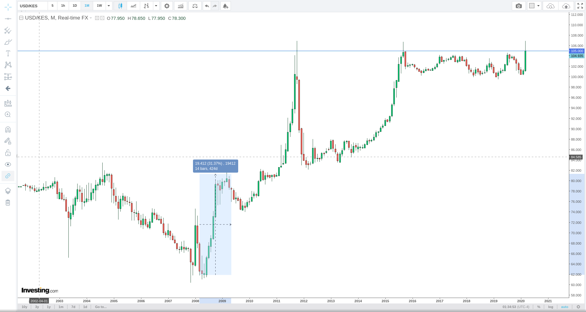

## Introduction

By now you have probably heard about 'bitcoin' and despite its many advantages over other forms of assets and money everyone agrees that bitcoin is highly volatile. 

>But, what if you could use bitcoin without being affected by its volatility?? 

This series of posts show you how to have a US dollar wallet without opening a US dollar account with your bank or physical dollar notes. This USD wallet is backed by bitcoin, through a stablecoin called Tether(USDT). It alllows you to virtually move between your local currency and the USD with the least loss(slippage). 

The closest alternative is using online banking to buy USD bank you require to hold both KSH and USD at the same bank to do this, or visit a Forex Bureau and use physical notes. 

>The same technology can be applied to buying gold (XAUT)

Bitcoin is used in the middle between your local currency USD. See flowchart below:

## Why you need a USD Wallet

During global uncertainity like the current COVID19 pandemic in 2020, it is a good idea to diversify your cash savings in USD, gold or bitcoin just incase your local currency loses value against the dollar.

The chart below shows the performance of the USD against the Kenya shilling since 2002. It is clear that the shilling has been losing its value against the dollar for the last 30 years. Open chart below and observe how it happened during the 2008 financial crisis and the shillign has never gone back to the 60s level ever.
> Fyi: During president's Kibaki first term in 2002, he managed to strengthen the shilling from 80s to 60s !!

During the last global financial crisis in 2008, you can read more about it [here](https://en.wikipedia.org/wiki/Financial_crisis_of_2007%E2%80%9308) the shilling lost 30% of its value in a span of two years (from 62 to 81).

Macroeconomics is a wide area of study with many things to consider ; Federal Reserve and Central Banks actions,  interest rates, treasury bonds yields, stock markets, oil, gold, unemployment rates etc.

However, what is clear to everyone observing the current situation is that both local and global productivity has been slowing down, several businesses have shutdown, some people have lost jobs, or experienced paycuts, rent defaults, debt defaults etc. 

It is difficult to predict when the pandemic will be over and things get back to normal, or how bad the economy will be affected, especially in developing countries which might face longer lockdowns.

Hence the need to spread your risk among assets that may hold their value more strongly, are **100% online** and have enough liquidity to get in and out. In my opinion that is; USD, gold and bitcoin.

### How the 'bitcoin-backed' USD wallet works

While there are several ways of having a bitcoin-backed USD wallet, this guide will use **Tether (USDT)**:

- You buy bitcoin, then use the bitcoin to buy tether. 
- [Tether](https://tether.to/?__cf_chl_jschl_tk__=353ac175af32529c8a92bc392f6a83ba906a0fc8-1585642069-0-AYxII_WswTRtQwiOW0UMtQqwaZnvS2KHCMDqqB5M_zgyUtQRW9UjmLafMEW1666Gr5hs7o_MmejJDCUCzq0CPJWZ3ZEJpo_dbxY0No6Q8Le379uSvm01AAHHhBnDo7mGQs2vTqvoCAZEwnbnouG6rfHb6plGg5o6cJA0zSUY3kcGptnUA2kE2IFtoH5fWLFYxr-eJsn7LoHlWVc9I7Mwg8uUAe8kOvSNR9lV2FQ4CRzZojmcSAhNtw8jChWFW_lVD8aw0AZ86DTE6g4TwBXwIuQ) is a cryptocurrency whose value is equal to the value of USD. Hence **1 Tether = 1 USD** thus 100 USDT can be redeemed for 100 USD and so forth
- When you want to cash out some USD to your local currency, you sell the equivalent tether/USDT to bitcoin, then sell the bitcoin back to your local currency. 
- Every country has independent traders who buy and sell bitcoin in exchange for local currency 24/7, so bitcoin -> local currency liquidity is guranteed

## Comparison of bitcon backed USD wallet vs Forex vs Banks

Three criteria are considered while comparing the best USD wallet:

+ Cost
+ Process
+ Availability/convenience

### Cost -Rates/Spread

The difference between the selling price and buying price of USDKES. The lower it is the better. Lower spread means there is less volatility since there is alot of willing buyers and sellers competing away till the spread becomes thin.

   + **Banks:** 
        + Very high. On April 3rd 2020, one of the local banks was selling the dollar at 109, while buying at 99. That is a 99/109 * 100 = **10.10%**
        + If you buy dollars at a bank today, if you want to sell them the next day, you will make a 10% loss of your money. For you to sell the dollars at a profit you would have to wait for the shilling to increase considerably for you to just break even
        + The non $100 notes are shunned and are bought below market rate
   + **Forex**
        + High. On April 3rd 2020, one local forex bureau was selling dollar at 107, while buying at 100. That is a 7/100 * 100 = **7%**
        + If you bought dollars at a forex bureau today, if you want to sell them the next day, you will make a 7% loss on your money. The dollar needs to rise by more than 7% for you to breakeven.
        + The non $100 notes are shunned and are bought below market rate
   + **Bitcoin**
        + Low. On April 3rd 2020, the cheapest bitcoin seller was selling at a rate of ksh. 764,000 per bitcoin while the highest buyer was buying at 752,000. Spread was (764000-752000) /752000 * 100 = **1.6%** 

### Process of getting dollar exposure and getting back to KSH

This criteria looks at the steps it takes to get dollar exposure and back to KSH  
+ **Banks:**
    +  Open USD and KSH accounts in a bank, activate online banking for both of them. Do forex ebtween the two accounts
    +  Withdraw ksh in one bank account, and buy USD Over the Counter(OTC) or walk in different bank (may be with lower USDKSH) still OTC
+ **Forex:**
    +  Walk in with local currency cash and buy physical dolllar bill
    +  Require national ID or passport

- **Bitcoin:**
    +  Open accounts at bitcoin exchanges
    +  Buy bitcoin ,tether(USDT) using exchange interface
    +  Online transactions

### Availability

A measure of convenience:

+ **Banks:**
    +  Online banking works 24/7. But you will use the provided rate which has 9-11% spread
    +  If you want a better rate it has to be within working hours so that you speak to a treasury bank staff to negotiate a better rate
    +  Other option is to walk in the banking hall within workin hours

+ **Forex**
    + The least convenient. Most work within working hours
    + Cash only
    + No online option. You need to be there
    + They have not yet solved the virtual/wallet/online problem yet

+ **Bitcoin**
    + The most convenient
    + Available 24/7 and 100% online
    + No physical cash trades
    + 24/7 access to USD wallet that you can liquidate any time
    + Since wallets are online, it can work on any phone, or computer device

        

### End to end process of moving from local currency (KSH) to bitcoin, to USD and back to local currency(KSH)

I have broken down this [process](/ Open accounts at bitcoin exchanges
        +  Buy bitcoin ,tether(USDT) using exchange interface
        +  Online transactions) into 9 different posts. 
        
Post 1, 2 and 7 are done only once during initial setup. 

Then the rest are done at different times based on what you want to achieve, but are dependent on some things to have been done earlier, for example; _you can't buy tether(USDT) without having bitcoin or ethereum in the first place_ 

The posts are listed below in their order of operations:

1.  Sign up for a localbitcoins account [click here](/signup-lbc)
2.  Sign up for a binance account [click here](/signup-binance)
3.  Buying bitcoins from localbitcoins [click here](/buy-bitcoin-lbc)
4.  Sending bitcoins from localbitcoins to your binance wallet [click here](/sendtobinance)
5.  Use the bitcoins deposited to binance to buy Tether/USDT [click here](/buy-tether)
6.  Sell Tether(USDT) to bitcoin(BTC) [click here](/sell-tether)
7.  Enable 2 Factor Authentication for your binance account [click here](/binance-2fa)
8.  Withdraw bitcoin from binance and send to localbitcoins [click here](sendbtc-to-lbc)
9.  Sell the bitcoin back to your local currency [click here](/sellbtc-ksh)