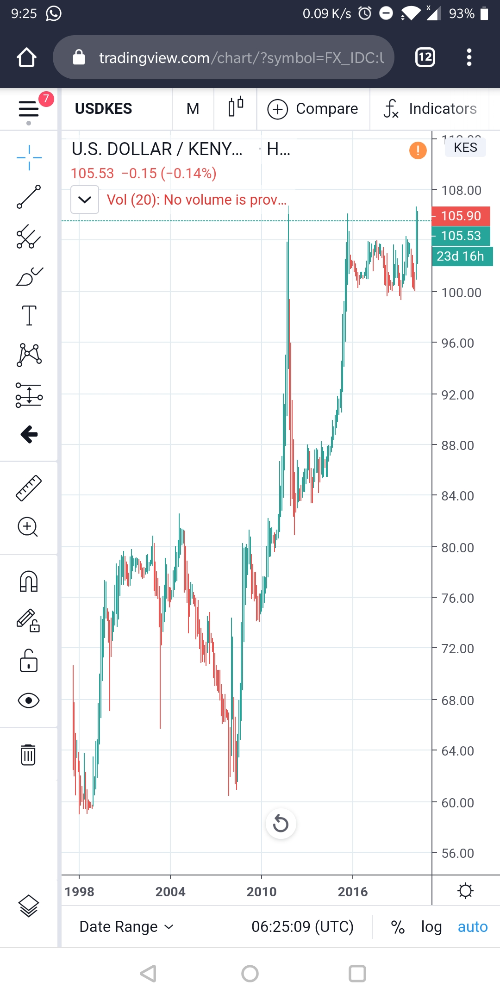
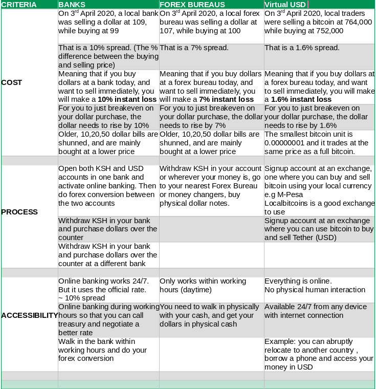

## Introduction

A virtual USD wallet enables you to store US dollars in an online-wallet that you can access 24/7, and it also allows you to convert a part or all of your US dollars to your local currency anytime.

Historically, most local currencies especially in developing countries have been losing their value to the US dollar. 
>For example, if you had Ksh. 100,000 in the year 2000 you could have bought $1408 dollars at the USDKES rate of 71. 

>If you saved the dollars till now and decided to convert back to KSH, you would get Ksh. 150,000 at the current USDKES rate of 106.5. 

>If however you saved in KSH and wanted to buy dollars now, you would only get (100,000/106.5) 938 dollars.

Chart below shows how the USD has been outperforming the shilling since 1998.

[Link](https://www.tradingview.com/chart/?symbol=FX_IDC%3AUSDKES) to the USDKES historical chart

### Why the US dollar is preferred to local currency

The main reason why the US dollar is the preferred currency to hold long-term is because it is the world's [reserve currency](https://en.wikipedia.org/wiki/Reserve_currency). It got this status during the [Bretton Woods conference](https://en.wikipedia.org/wiki/Bretton_Woods_system) in 1945, replacing the British Pound. The US dollar was backed with gold. Meaning you could take dollars to a bank and get gold in return.

How is a global reserve currency used:
- Countries borrowing and repaying debt to other countries  
- Commercial banks hold USD to facilitate international transfers, e.g when you make a wire transfer to a different country, even if the receiver is using a different currency, the intermediary banks use USD to settle between them 
- Central Banks hold large amounts of USD to payinternational debts and to influence the domestic exchange rate 
- Oil trades are settled in USD etc

The current global pandemic (COVID19) makes it even more important to hold a part of your wealth in USD rather than local currency.

> Other safe havens to hold your wealth in are gold and bitcoin, they are discussed in my other articles [click here](/buy-gold-xaut) to know how you can buy gold, [click here](/bitcoin-introduction) to know more about bitcoin

### How the 'bitcoin-backed' USD wallet works

- You buy bitcoin using your local currency, immediately send the bitcoin to a cryptocurrency exchange called binance and buy tether(USDT) using the bitcoin. You now have USD
- [Tether](https://tether.to/?__cf_chl_jschl_tk__=353ac175af32529c8a92bc392f6a83ba906a0fc8-1585642069-0-AYxII_WswTRtQwiOW0UMtQqwaZnvS2KHCMDqqB5M_zgyUtQRW9UjmLafMEW1666Gr5hs7o_MmejJDCUCzq0CPJWZ3ZEJpo_dbxY0No6Q8Le379uSvm01AAHHhBnDo7mGQs2vTqvoCAZEwnbnouG6rfHb6plGg5o6cJA0zSUY3kcGptnUA2kE2IFtoH5fWLFYxr-eJsn7LoHlWVc9I7Mwg8uUAe8kOvSNR9lV2FQ4CRzZojmcSAhNtw8jChWFW_lVD8aw0AZ86DTE6g4TwBXwIuQ) is a cryptocurrency whose value is equal to the value of USD. Hence **1 Tether = 1 USD** thus 100 USDT can be redeemed for 100 USD and so forth
- When you want to cash out some USD to your local currency, you sell the equivalent tether to bitcoin, then sell the bitcoin back to your local currency
- Bitcoin is used in the middle between your local currency USD. See flowchart below:

## Comparison of getting USD exposure through banks vs forex vs a virtual USD wallet

Apart from having your wealth in USD by using the 'bitcoin-backed' virtual wallet, you can achieve the same by purchasing US dollars in a commercial bank or a Foreign Exchange Bureau.

I would like to compare these 3 methods using 3 key factors:

+ Cost
+ Process
+ Availability/convenience

   

Based on the above criteria, the virtual USD wallet is better. Since the agenda of the whole process is to potect your savings, the method that has a low spread is highly preferred. Cost is measured using spread (the % difference between the buying price and selling price). A higher spread, the higher the cost of getting in and out. The lower the spread, the lower the cost of getting in and out since it means that there is a high competition between sellers and buyers hence narrowing the spread. 

The virtual USD has asignificant advantage in its process and accessibility because all transactions are online, requiring no physical human interaction.

>With the global pandemic of COVID19, financial transactions that require physical cash or close human interaction should be avoided if possible or done very cautiously

### End to end process of moving from local currency (KSH) to bitcoin, to USD and back to local currency(KSH)

I have broken down the whole process process into 9 different articles, post 1, 2 and 7 are done only once during initial setup. While  the rest are done at different times based on what you want to achieve, but some are dependent on some things to have been done earlier, for example; _you can't buy tether(USDT) without having bitcoin in the first place_ 

The posts are listed according to their order of operations:

1.  Sign up for a localbitcoins account [click here](/signup-lbc)
2.  Sign up for a binance account [click here](/signup-binance)
3.  Buying bitcoins from localbitcoins [click here](/buy-bitcoin-lbc)
4.  Sending bitcoins from localbitcoins to your binance wallet [click here](/sendtobinance)
5.  Use the bitcoins deposited to binance to buy Tether/USDT [click here](/buy-tether)
6.  Sell Tether(USDT) to bitcoin(BTC) [click here](/sell-tether)
7.  Enable 2 Factor Authentication for your binance account [click here](/binance-2fa)
8.  Withdraw bitcoin from binance and send to localbitcoins [click here](sendbtc-to-lbc)
9.  Sell the bitcoin back to your local currency [click here](/sell-btc-to-ksh)